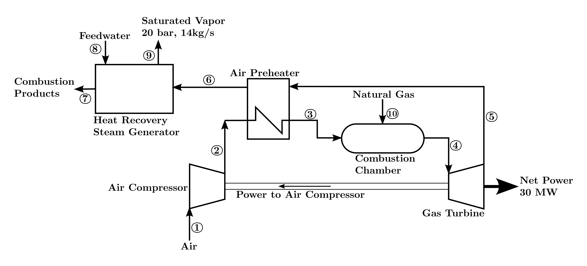

# Optimization of CGAM Cogeneration System in IDAES
## Problem Statement
### Base-case Design of the Cogeneration System

<figure>
  
</figure>

### Parameter highlighting
- Specified input parameters: **`highlighted`**
- Results of simulation: normalfont

 ### Table: Mass flow rate, temperature, and pressure data for the cogeneration system
 |State|Substance|Mass Flow Rate (kg/s)|Temperature (K)|Pressure (bars)|
|:---|:---:|:---:|:---:|:---:|
|1|Air|91.2757|**`298.150`**|**`1.013`**|
|2|Air|91.2757|603.738|10.130|
|3|Air|91.2757|**`850.000`**|9.623|
|4|Combustion Products|92.9176|**`1520.000`**|9.142|
|5|Combustion Products|92.9176|1006.162|1.099|
|6|Combustion Products|92.9176|779.784|1.066|
|7|Combustion Products|92.9176|426.897|**`1.013`**|
|8|Water|**`14.0000`**|**`298.150`**|**`20.000`**|
|9|Water|14.0000|485.570|20.000|
|10|Methane|1.6419|**`298.150`**|**`12.000`**|

### Table: Parameters and Decision Variables
|Parameter, decision variable|Symbol|Value|Unit|
|:---|:---:|:---:|:---:|
|**Ambient State**||||
|Temperature|$T_0$|298.15|K|
|Pressure|$p_0$|1.013|bar|
|**Overall process requirements**||||
|Net power output|$\dot{W}_{net}$|30|MW|
|Mass flow rate of steam|$\dot{m}_{steam}$|14|kg/s|
|Pressure of steam|$p_{steam}$|20|bar|
|Quality of steam|$x$|1||
|**Overall process decision variables**||||
|Pressure ratio of compression|$r_{p,AC}$|10||
|Isentropic efficiency of air compressor|$\eta_{s,AC}$|0.86||
|Isentropic efficiency of expander|$\eta_{s,EXP}$|0.86||
|Combustion chamber inlet temperature|$T_3$|850|K|
|Expander inlet temperature|$T_4$|1520|K|
|**Remaining flow- and component-based specifications**||||
|**Molar Analysis of Air**||||
|$N_2$ mole percent||77.48||
|$O_2$ mole percent||20.59||
|$CO_2$ mole percent||0.03||
|$H_2O$ mole percent||1.9||
|**Fuel**||||
|Temperature|$T_{10}$|298.15|K|
|Pressure|$p_{10}$|12|bar|
|Molar Analysis of $CH_4$||100||
|**Air Preheater (APH)**||||
|Pressure loss, air side|$\Delta{p}_{air,APH}$|5%||
|Pressure loss, flue gas side|$\Delta{p}_{fluegas,APH}$|3%||
|**Combustion Chamber**||||
|Thermal efficiency|$\eta_{CC}$|0.98||
|Pressure loss|$\Delta{p}_{CC}$|5%||
|**Heat Recovery Steam Generator**||||
|Pressure loss, flue gas side|$\Delta{p}_{fluegas,HRSG}$|5%||
|Pressure loss, water side|$\Delta{p}_{water,APH}$|0%||

### Table: Dependent Variables
|Variable|Symbol|
|:---|:---:|
|Mass flow rate of air|$\dot{m}_{air}$|
|Mass flow rate of fuel|$\dot{m}_{fuel}$|
|Mass flow rate of flue gas|$\dot{m}_{fluegas}$|
|Molar analysis of flue gas||
|$N_2$ mole percent||
|$O_2$ mole percent||
|$CO_2$ mole percent||
|$H_2O$ mole percent||
|Pressures|$p_2$, $p_3$, $p_4$, $p_5$, $p_6$|
|Temperatures|$T_2$, $T_5$, $T_6$, $T_7$, $T_9$|
|Work rates||
|Work rate of Air Compressor|$\dot{W}_{AC}$|
|Work rate of Expander|$\dot{W}_{EXP}$|

## Results
### Table: Validation of Combustion Chamber
|Variable|Symbol|Unit|Reference Value from Literature|Value from IDAES|$\Delta_{rel}=$|

